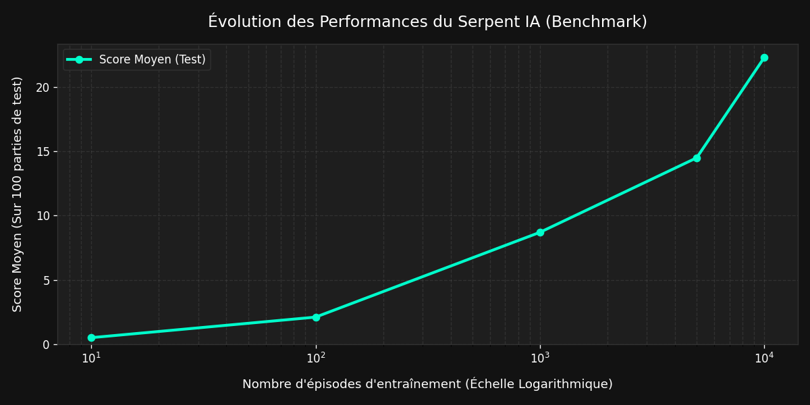

# 🐍 Snake IA — Apprentissage par Imitation + Renforcement

Ce projet implémente un système d'Intelligence Artificielle modulaire combinant du **Behavioral Cloning** (apprentissage supervisé à partir de vos propres parties) et du **Deep Q-Learning (DQN)** (apprentissage par renforcement autonome). Il est conçu pour être extrêmement léger et optimisé pour tourner sur le processeur CPU 4 cœurs d'un **Orange Pi 3B**.

## 📖 Documentation Scientifique
Pour comprendre la formulation mathématique du projet (Processus de Décision Markovien, Équation de Bellman, Cross-Entropy Loss et Double Réseau DQN), consultez le document :
👉 **[Rapport Technique de Modélisation Mathématique](Rapport_Technique.md)**

---

## 🏗️ Architecture du Projet

```
Snake-AI/
├── config.py              # Centralisation des constantes et hyperparamètres
├── game.py                # Moteur physique du Snake (double mode graphique/headless)
├── model.py               # Réseau feed-forward 11 -> 256 -> 128 -> 3 (~36k params)
├── agent_dqn.py           # Algorithme DQN (Replay Buffer, target network)
├── train_dqn.py           # Entraînement DQN classique en ligne de commande
├── train_multi_dqn.py     # NOUVEAU : Entraînement de 7 agents en parallèle + Graphe interactif + Slider FPS
├── play_and_record.py     # Enregistrement direct et automatique des parties humaines
├── train_imitation.py     # Apprentissage par imitation (Behavioral Cloning)
├── demo_ia.py             # Visualisation graphique du modèle entraîné
└── Rapport_Technique.md   # Explication théorique détaillée
```

## 📝 License

Ce projet est sous licence **MIT** (Open Source avec attribution requise). Voir le fichier [LICENSE](LICENSE) pour plus de détails.

---

## 📊 Benchmark de Performance

L'évolution des performances du modèle DQN est évaluée automatiquement toutes les 100 parties d'entraînement (sur 100 parties de test indépendantes en mode exploitation pure). La courbe ci-dessous est mise à jour dynamiquement au fil de l'apprentissage :



---

## 🚀 Guide Rapide de Lancement

### 1. Installation des dépendances
```bash
pip install torch --index-url https://download.pytorch.org/whl/cpu numpy pygame
```

### 2. Étape A : Apprentissage par Imitation (Behavioral Cloning)
Pour enseigner à l'IA vos propres réflexes et lui donner une base solide :
```bash
# Lancez le jeu et faites quelques parties (18 FPS par défaut)
python play_and_record.py

# Lancez l'entraînement supervisé (qui copie votre comportement)
python train_imitation.py --epochs 50
```

### 3. Étape B : Apprentissage par Renforcement (RL DQN)
Pour faire progresser l'IA de manière autonome :
```bash
# Mode interactif multi-agents (7 IA simultanées + 1 graphe + 1 Slider de vitesse)
python train_multi_dqn.py

# Mode headless (sur Orange Pi, vitesse max débridée par défaut, ou limitée en steps/s)
python train_dqn.py --max-steps-s 1000   # Exemple : limite à 1000 calculs par seconde
```

### 4. Étape C : Démo visuelle
Regardez le serpent final naviguer sur la grille :
```bash
# Visualiser le DQN
python demo_ia.py

# Visualiser le modèle d'imitation
python demo_ia.py --imitation
```

---

## ⚙️ Optimisations pour Orange Pi 3B (ARM)
*   **Limitation des Threads PyTorch** : Configuré à 4 threads dans `config.py` pour correspondre précisément aux 4 cœurs physiques du CPU ARM.
*   **Vecteur d'état compact (11 dimensions)** : Évite de passer des images brutes (convolution), ce qui réduit la charge CPU.
*   **Taille de réseau minimisée** : Moins de 36 000 paramètres, garantissant des inférences en moins de 1ms sur CPU ARM.
*   **Graphiques natifs Pygame** : Aucun outil tiers lourd n'est utilisé pour tracer les graphiques d'analyse en temps réel.
